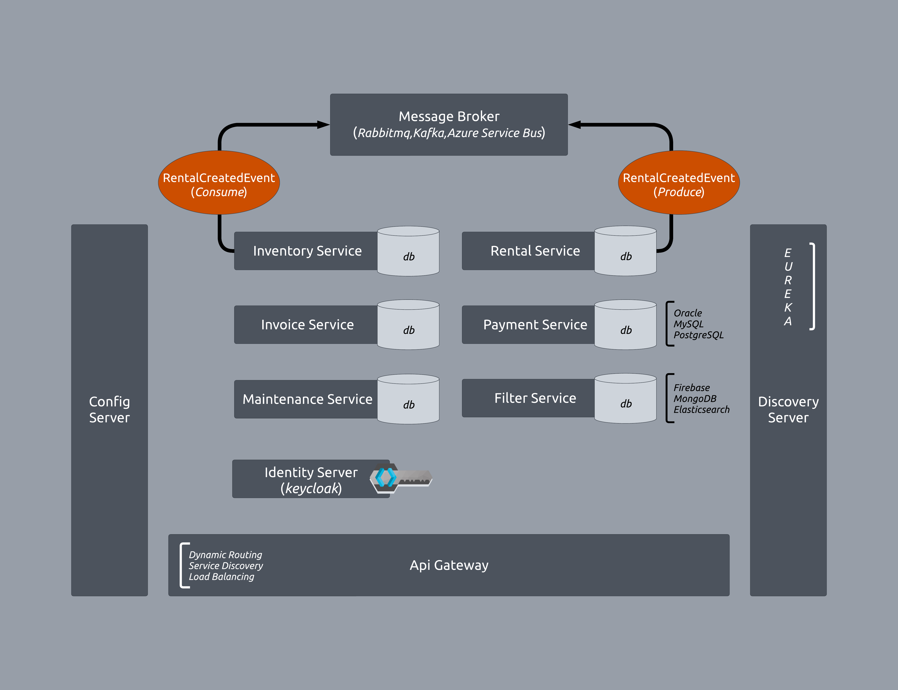

# Microservices-RentACar

This project demonstrates a microservices-based architecture for a car rental system. It leverages modern technologies to create scalable, maintainable, and distributed systems.

### Features
- Car Inventory Management: Add, update, and remove car details.
- Rental Management: Handle car rental bookings and track their statuses.
- Payment Processing: Simulate and manage payments for rentals.
- Maintenance Tracking: Log and manage vehicle maintenance activities.
- Invoice Generation: Automatically generate and store invoices for rentals.
- Service Discovery: Simplify microservice communication via a discovery server.
- Monitoring and Logging: Integrated with tools for tracking system health and performance.

### Technologies Used
The project employs the following technologies and tools:

- Backend Framework: Spring Boot for developing the microservices.
- Database: PostgreSQL, MySQL, and MongoDB for relational and NoSQL storage.
- Event Communication: Apache Kafka for asynchronous messaging between services.
- Service Discovery: Eureka for service registry and discovery.
- API Gateway: Spring Cloud Gateway to route requests to appropriate services.
- Authentication and Authorization: Keycloak for user management and security.
- Containerization: Docker to package microservices and their dependencies.
- Monitoring and Tracing: Tools like Prometheus, Grafana, and Zipkin for performance insights.
- Resilience: Resilience4j for implementing patterns like circuit breakers and retries.
- Code Simplification: Lombok for boilerplate code reduction.

### Architecture
The system is divided into modular microservices:

- Filter Service: Fetch car details using MongoDB for fast lookups.
- Inventory Service: Manage cars and integrate with PostgreSQL.
- Rental Service: Process car rentals and verify availability.
- Payment Service: Handle payments using PostgreSQL.
- Maintenance Service: Track vehicle maintenance using MySQL.
- Invoice Service: Generate and store invoices in MongoDB.
- Common Package: Shared utilities like DTOs, exception handlers, and custom annotations.

